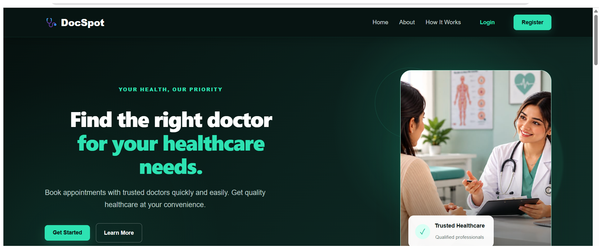
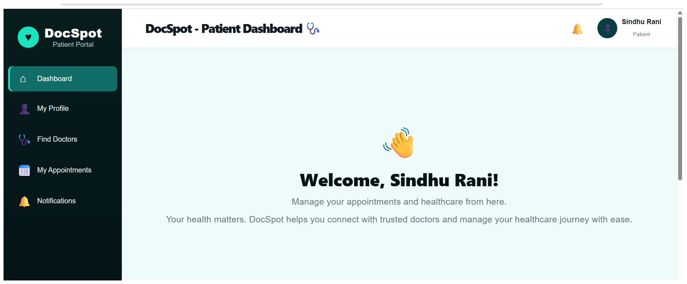
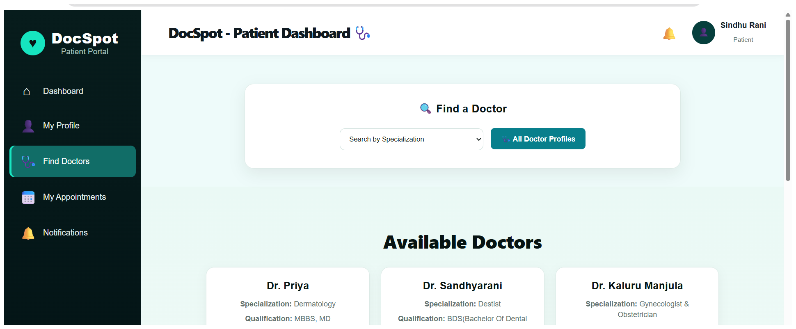
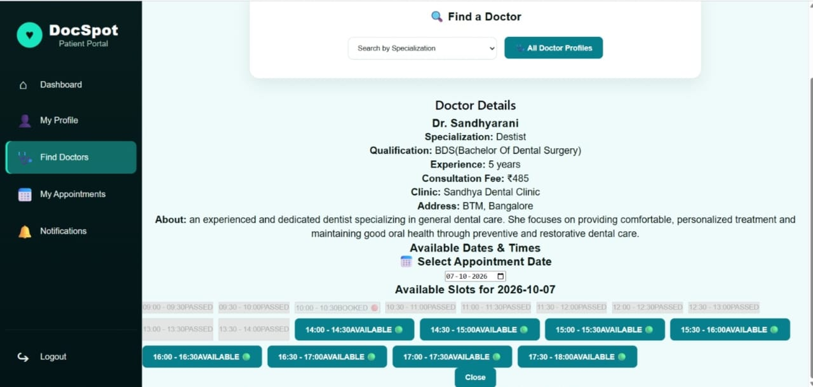
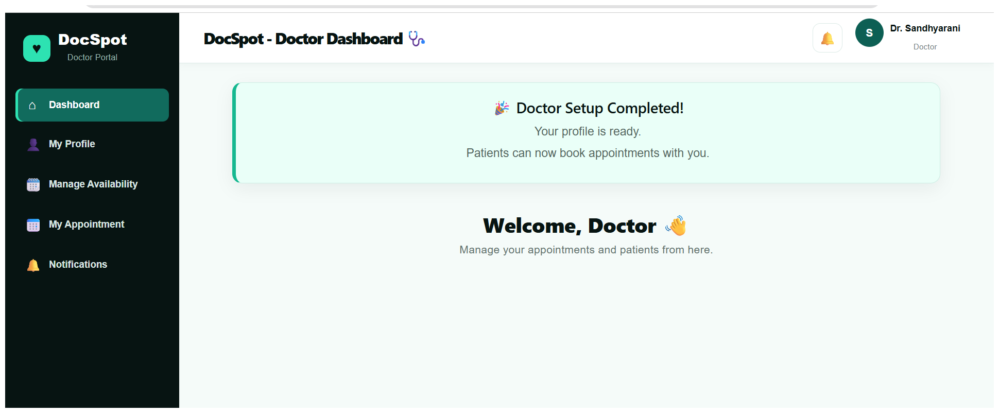
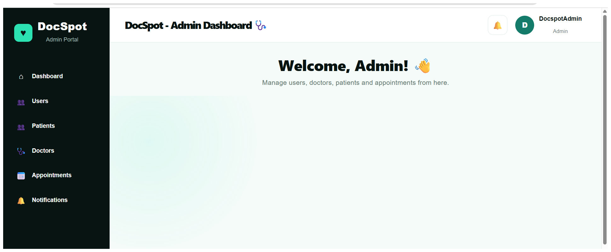

# 🩺 DocSpot — Doctor Appointment Booking Platform

[](https://doc-spot-healthcare-platform.vercel.app/)
[](https://react.dev/)
[](https://spring.io/projects/spring-boot)
[](https://www.mysql.com/)
[](https://vercel.com/)

> A full-stack doctor appointment booking platform that connects patients, doctors, and administrators through a centralized healthcare management system.

DocSpot is a web-based healthcare appointment management platform designed to simplify the process of finding doctors, booking appointments, managing schedules, and handling healthcare-related activities through dedicated patient, doctor, and admin dashboards.

The application provides role-based access and workflows for patients, doctors, and administrators, with a responsive frontend, RESTful backend services, and a MySQL database.

## 🔗 Live Application

**Live Demo:** https://doc-spot-healthcare-platform.vercel.app/

**GitHub Repository:** https://github.com/sindhurani04/
DocSpot-Healthcare-Platform

## ✨ Key Features

### 👤 Patient Features

- Patient registration and secure login
- Patient profile management
- Browse and search available doctors
- View doctor profiles and details
- Check doctor availability
- Book appointments with doctors
- Provide a reason while booking an appointment
- View upcoming and previous appointments
- Cancel appointments
- Track appointment status
- Receive appointment notifications
- View doctor confirmation notifications
- Secure logout

### 👨‍⚕️ Doctor Features

- Doctor registration and login
- Doctor profile management
- Add and manage professional details
- Manage consultation fee and clinic information
- Configure availability
- Manage appointment schedules
- View patient appointments
- Receive appointment notifications
- Confirm patient appointments
- Track appointment status
- Secure logout

### 🛡️ Admin Features

- Secure administrator login
- View and manage users
- Manage registered patients
- Manage registered doctors
- Approve doctor registrations
- Block and unblock doctors
- View and manage appointments
- Monitor the overall appointment system
- Manage platform-level activities

### 📅 Appointment Management

- Doctor availability-based booking
- Appointment status tracking
- Pending and confirmed appointment states
- Appointment cancellation
- Doctor confirmation workflow
- Patient and doctor notifications

## 🏗️ System Architecture

DocSpot uses a three-tier full-stack architecture connecting the user interface, backend services, and database.

                    👥 USERS
             Patient • Doctor • Admin
                         │
                         ▼
              ┌───────────────────┐
              │  🖥️ FRONTEND      │
              │   React + Vite    │
              └─────────┬─────────┘
                        │
                    REST API
                        │
                        ▼
              ┌───────────────────┐
              │  ⚙️ BACKEND       │
              │   Spring Boot     │
              │ Security • APIs   │
              │ Services • JPA   │
              └─────────┬─────────┘
                        │
                   JPA / Hibernate
                        │
                        ▼
              ┌───────────────────┐
              │  🗄️ DATABASE      │
              │      MySQL        │
              └───────────────────┘

              ☁️ CLOUD DEPLOYMENT

          Vercel              Railway
       ┌───────────┐      ┌──────────────┐
       │ Frontend  │ ───► │ Backend      │
       │ React     │      │ Spring Boot  │
       └───────────┘      │ + MySQL      │
                          └──────────────┘

## 📅 Appointment Workflow

The appointment workflow allows patients to request appointments based on doctor availability, while doctors can review and confirm appointment requests.

```text
👤 Patient
     │
     ▼
🔎 Find Doctor
     │
     ▼
👨‍⚕️ View Doctor Details
     │
     ▼
📅 Check Availability
     │
     ▼
📝 Select Date & Time
     │
     ▼
📋 Submit Appointment Request
     │
     ▼
⏳ PENDING
     │
     ▼
🔔 Doctor Receives Notification
     │
     ▼
👨‍⚕️ Doctor Reviews Request
     │
     ▼
✅ Doctor Confirms
     │
     ▼
🟢 CONFIRMED
     │
     ▼
🔔 Patient Receives Confirmation
```

### 🔄 Workflow Steps

1. **Find Doctor** — Patient searches for a suitable doctor.
2. **View Doctor Details** — Patient reviews the doctor's profile and professional information.
3. **Check Availability** — Patient checks the available dates and time slots.
4. **Select Date & Time** — Patient selects a suitable appointment slot.
5. **Submit Appointment Request** — Patient provides the reason and submits the appointment request.
6. **Pending** — The appointment is created with `PENDING` status.
7. **Doctor Notification** — The doctor receives a notification about the new appointment request.
8. **Doctor Review** — The doctor reviews the appointment details.
9. **Confirmation** — The doctor confirms the appointment.
10. **Confirmed** — The appointment status changes to `CONFIRMED`.
11. **Patient Notification** — The patient receives a confirmation notification.

---

## 🛠️ Technology Stack

### 🎨 Frontend

- React
- Vite
- JavaScript
- HTML5
- CSS3

### ⚙️ Backend

- Java
- Spring Boot
- Spring Security
- Spring Data JPA
- Hibernate

### 🗄️ Database

- MySQL

### 🔐 Security

- Spring Security
- Password Encryption
- Role-Based Access Control

### ☁️ Deployment & Hosting

- **Vercel** — Frontend
- **Railway** — Backend & MySQL

### 🧰 Development Tools

- Visual Studio Code
- Git
- GitHub
- Postman
- Maven

## 📁 Project Structure

````text
DocSpot/
│
├── Backend/
│   └── docspot/
│       ├── src/
│       │   └── main/
│       │       ├── java/
│       │       │   └── com/docspot/
│       │       └── resources/
│       │
│       └── pom.xml
│
├── Frontend/
│   ├── src/
│   ├── public/
│   ├── package.json
│   └── vite.config.js
│
├── screenshots/
│
├── .gitignore
├── README.md
└── docspot_backup.sql


## 🗄️ Database

DocSpot uses **MySQL** as the relational database for storing and managing application data.

### 📊 Database Tables

| Table | Description |
|---|---|
| `users` | Stores patient, doctor, and admin user information |
| `doctors` | Stores doctor profiles and professional details |
| `appointments` | Stores appointment bookings and appointment status |
| `notifications` | Stores notifications for patients and doctors |
| `doctor_availability` | Stores available doctor time slots |
| `doctor_weekly_schedule` | Stores recurring weekly doctor schedules |

### 🔗 Database Structure

```text
👤 Users
   │
   ├──────────────► 👨‍⚕️ Doctors
   │                    │
   │                    ├── 📅 Doctor Availability
   │                    │
   │                    └── 📆 Weekly Schedule
   │
   └──────────────► 📋 Appointments
                         │
                         └── 🔔 Notifications
````

## 🔐 Authentication & Security

DocSpot implements secure authentication and role-based access control to protect user accounts and application features.

### 🔑 Authentication

- User registration and login
- Secure password encryption
- Session-based user authentication
- Logout functionality

### 👥 Role-Based Access

- **Patient** — Book and manage appointments
- **Doctor** — Manage profile, availability, and appointments
- **Admin** — Manage users, doctors, and appointments

### 🛡️ Security

- Spring Security for backend security
- Protected API endpoints
- Role-based authorization
- CORS configuration for secure frontend-backend communication

## 🔗 Backend API

The DocSpot backend provides RESTful APIs for authentication, user management, doctor management, appointments, availability, and notifications.

### 🔑 Authentication APIs

| Method | Endpoint             | Description         |
| ------ | -------------------- | ------------------- |
| `POST` | `/api/auth/register` | Register a new user |
| `POST` | `/api/auth/login`    | Authenticate user   |

### 👨‍⚕️ Doctor APIs

- Doctor profile management
- Doctor availability management
- Doctor appointment management
- Doctor approval and status management

### 📅 Appointment APIs

- Create appointment
- View appointments
- Update appointment status
- Cancel appointment

### 🔔 Notification APIs

- Create notifications
- Retrieve user notifications
- Manage notification status

## ⚙️ Local Development Setup

Follow the steps below to run DocSpot on your local machine.

### 📋 Prerequisites

Make sure the following tools are installed:

- ☕ Java 21
- 📦 Maven
- 🟢 Node.js
- 📦 npm
- 🗄️ MySQL
- 🔧 Git

### 1️⃣ Clone the Repository

```bash
git clone https://github.com/sindhurani04/DocSpot-Healthcare-Platform.git
cd DocSpot-Healthcare-Platform
```

### 2️⃣ Configure MySQL

Create the local database:

```sql
CREATE DATABASE docspot;
```

Configure the local Spring Boot database connection using your own credentials.

Example:

```properties
spring.datasource.url=jdbc:mysql://localhost:3306/docspot
spring.datasource.username=root
spring.datasource.password=YOUR_PASSWORD
spring.jpa.hibernate.ddl-auto=update
```

> ⚠️ **Security Note:** Never commit passwords, environment secrets, or private configuration to GitHub.

### 3️⃣ Start the Backend

Navigate to:

```text
Backend/docspot
```

Run:

```cmd
mvnw.cmd spring-boot:run
```

The backend will be available at:

```text
http://localhost:8080
```

### 4️⃣ Start the Frontend

Open a new terminal and navigate to:

```text
Frontend
```

Install the dependencies:

```cmd
npm install
```

Start the development server:

```cmd
npm run dev
```

The frontend will be available at:

```text
http://localhost:5173
```

### 5️⃣ Open the Application

Open your browser and visit:

```text
http://localhost:5173
```

🎉 **DocSpot is now running locally!**

## 🚀 Deployment

DocSpot uses the following production architecture:

```text
                         GitHub
                            │
                 ┌──────────┴──────────┐
                 │                     │
                 ▼                     ▼
            ┌─────────┐          ┌──────────┐
            │ Vercel  │          │ Railway  │
            │Frontend │          │ Backend  │
            └─────────┘          └────┬─────┘
                                      │
                                      ▼
                               ┌────────────┐
                               │  Railway   │
                               │   MySQL    │
                               └────────────┘
```

### 🌐 Deployment Services

- **Frontend:** Vercel
- **Backend:** Railway
- **Database:** Railway MySQL

### 🔗 Production Application

**Live Application:**
https://doc-spot-healthcare-platform.vercel.app/

---

## 🧪 Testing

The application was tested across the major user workflows.

### 👤 Patient

- Registration and login
- Profile management
- Doctor search and details
- Availability checking
- Appointment booking
- Appointment cancellation
- Appointment status tracking
- Notifications

### 👨‍⚕️ Doctor

- Registration and login
- Profile management
- Availability management
- Appointment management
- Appointment confirmation
- Notifications

### 🛡️ Admin

- Login
- User management
- Patient management
- Doctor management
- Doctor approval
- Doctor blocking and unblocking
- Appointment management

### 🔄 End-to-End Appointment Flow

```text
👤 Patient
     │
     ▼
📅 Books Appointment
     │
     ▼
⏳ PENDING
     │
     ▼
🔔 Doctor Receives Notification
     │
     ▼
👨‍⚕️ Doctor Confirms
     │
     ▼
✅ CONFIRMED
     │
     ▼
🔔 Patient Receives Notification
```

## 📸 Screenshots

### 🏠 Landing Page



### 👤 Patient Dashboard



### 🔎 Find Doctors



### 📅 Appointment Booking



### 👨‍⚕️ Doctor Dashboard



### 🛡️ Admin Dashboard



## 🌟 Project Highlights

- Full-stack healthcare appointment management platform
- Three role-based user experiences
- Patient-to-doctor appointment workflow
- Doctor availability management
- Appointment confirmation system
- Application notifications
- Admin management capabilities
- RESTful backend architecture
- Role-based security
- MySQL relational database
- Cloud deployment using Vercel and Railway
- Responsive web-based interface

---

## 🔮 Future Enhancements

- Online payment integration
- Video consultation
- Prescription management
- Email and SMS notifications
- Advanced doctor search and filtering
- Appointment reminders
- Medical document management
- Analytics dashboard
- Doctor ratings and reviews
- AI-assisted healthcare features

---

## 👩‍💻 Author

**M. Sindhu Rani**

**B.Tech — Artificial Intelligence**

Interested in software development, artificial intelligence, full-stack development, and building practical technology solutions.

**GitHub:** [sindhurani04](https://github.com/sindhurani04)

---

## 📄 License

This project was developed as a full-stack software project for learning, portfolio development, and demonstration purposes.

---

## ⭐ Support

If you find this project useful or interesting, consider giving the repository a ⭐ on GitHub.
